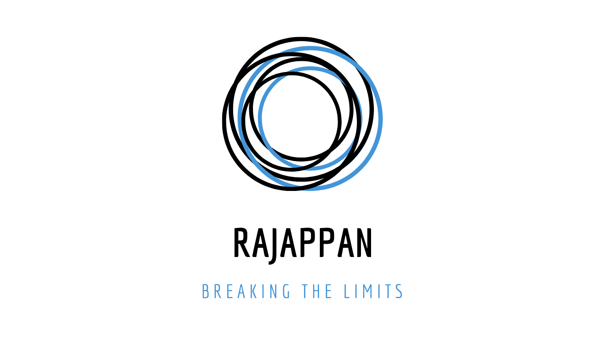

# The Rajappan Project

An All in one Project for Digital Privacy. A step towards a PRIVATE FUTURE

---------

>Wanna explore the Rajappan Project? Okay! We got you.
Click the links below to jump in !!!

Infosec Resources for Red/Blue/Purple Teams

 

--> [**Red Team**](infosec/RedTeam)

--> [**Blue Team**](infosec/BlueTeam)

--> [**Purple Team**](infosec/PurpleTeam/README.md)

--> [**OSINT**](osint/README.md)

Learning Path

 

--> [**Blogs & Mailing Lists**](learning-path/blog.md)

--> [**Cheatsheets**](learning-path/cheatsheets.md)

--> [**Cyber Careers**](learning-path/career.md)

--> [**Cyber Starter Pack**](learning-path/starter-pack.md)

--> [**Privacy Guide and Digital Security Articles**](learning-path/guide-art.md)

--> [**Security Conferences and Podcasts**](learning-path/conf-pod.md)

--> [**Security Books**](learning-path/books.md)

--> [**Powerful Toolkits**](learning-path/toolkits.md)

--> [**Youtube Channels**](learning-path/video.md)

Privacy

 

--> [**Privacy Resources**](privacy/README.md)

---------

We practice <strong>Ethical</strong> Design.

